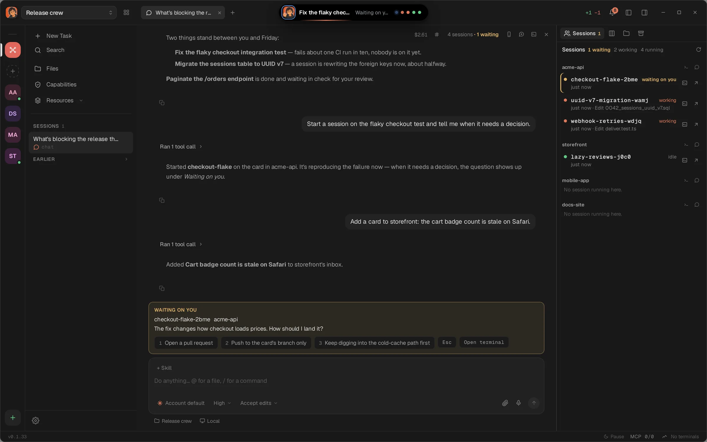

<p align="center">
  
</p>

<h1 align="center">devpit</h1>

<p align="center">
  A native app for controlling your coding agents.
</p>

<p align="center">
  <a href="https://github.com/jholhewres/devpit/actions/workflows/ci.yml"></a>
  <a href="LICENSE"></a>
  
  
</p>

<p align="center">
  <b>English</b> &middot; <a href="README.pt-BR.md">Português</a>
</p>

<p align="center">
  
</p>

---

## What it is

A desktop app that keeps your coding agents in view: one terminal you are
watching, a board that says where each piece of work stands, and the cost of
every agent call.

## What it does

- **One target terminal per project**; other sessions keep running in the background.
- **Sessions that outlive the window**: they are tmux sessions.
- **A git worktree per card**, made when a step needs one.
- **A board per project** whose columns run steps: an agent, a session or your own command.
- **A spending cap on every agent call**, and the real cost on the card.
- **An orchestrator** chat that sees every project and can hand work to sessions.
- **A browser pane** for the page your project serves.
- **File tree and diffs** beside the terminal.
- **Local first**: everything lives in `~/.devpit`; an account is optional.

## Install

```sh
curl -fsSL https://devpit.app/install.sh | sh
```

Linux and macOS; it checks the download against the release's `SHA256SUMS`.
Windows, manual downloads, updates and uninstalling:
[docs/install.md](docs/install.md). Needs `tmux` and
[Claude Code](https://claude.com/claude-code).

## Links

- [Documentation](https://devpit.app/docs)
- [What it does, in detail](docs/features.md)
- [How the board works](docs/board.md)
- [Building and running](docs/building.md)
- [The model](docs/the-model.md) · [Architecture](docs/architecture.md)
- [Changelog](CHANGELOG.md) · [Contributing](CONTRIBUTING.md)
- [Licence: Apache 2.0](LICENSE)
